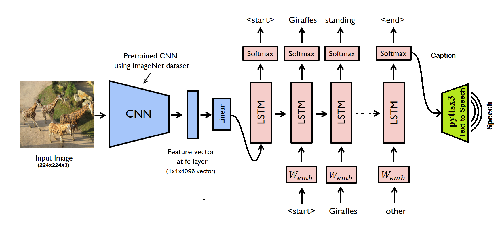
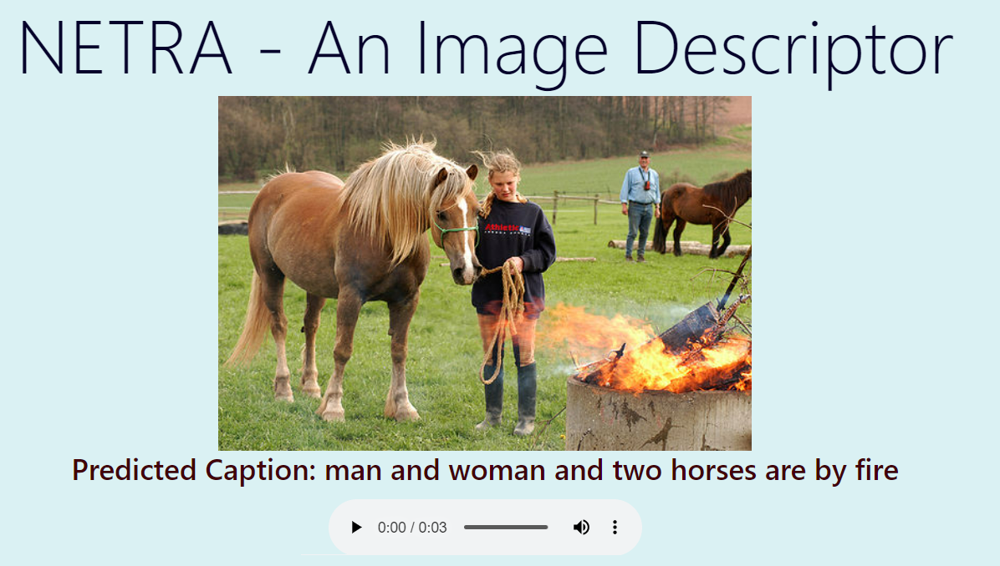
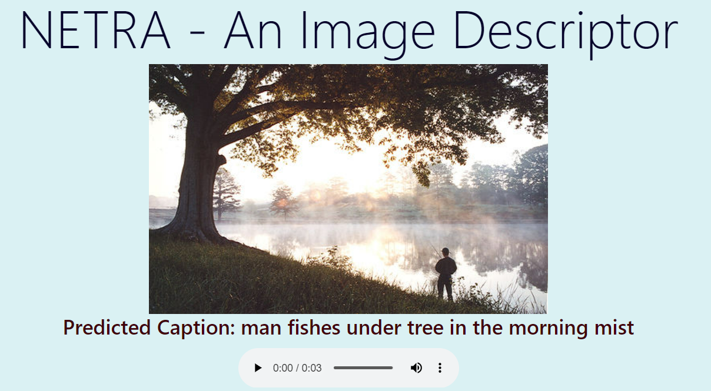
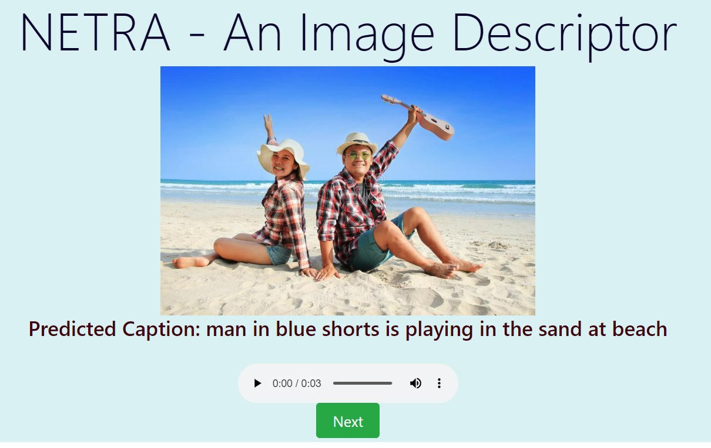
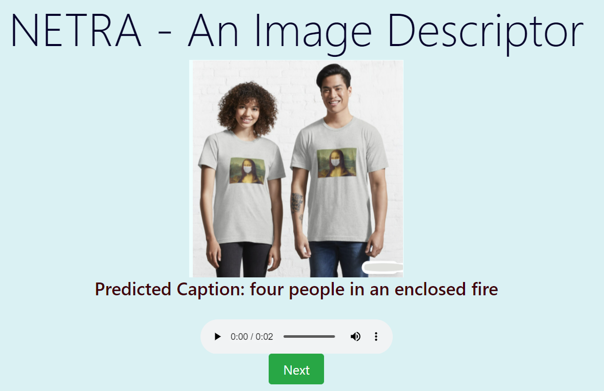

# NETRA: An Image Descriptor

Automatically generating a natural language description of an image is a ***major challenging task*** in the field of artificial intelligence. Generating a description of an image brings together the fields: ***Natural Language Processing*** and ***Computer Vision***. There are two types of approaches i.e. top-down and bottom-up. In this project, we followed a top-down approach starting from extracting image features and finally generating meaningful textual description (caption) into speech form. 

In our model, firstly the fixed size of the image is passed to the pre-trained model of **Convolutional Neural Network** named (**VGG-16**) encoder that extracts the features present in the image which are then fed to **LSTM**, finally generating the meaningful captions. The model is successful in generating realistic image captions with **model accuracy** of **60.07%** and **validation accuracy** of **42.51%**.

To evaluate the model performance, we used **BLEU** (*Bilingual Evaluation Understudy*) score and matched predicted words to the original caption. Our model scored **BLEU-1**, **BLEU-2**, **BLEU-3**, **BLEU-4** as **0.43**, **0.25**, **0.18**, **0.09** respectively.

## :rocket: Working

For test image outputsample1 and outputsample2.png, The model describes the image without any errors.

For test image outputsample_3and outputsample_4, The model describes the images by misinterpreting the content.

## :warning: Limitations

Every study has limitations, and the following are limitations of our project.

1. The scope of the project is determined by the used dataset. As such, if input images are not similar to those images present in the used dataset we can encounter random and meaningless captions.

2. The language model is not dynamic at all i.e. we are unable to add new words to our language model without retraining the model. Hence, it does not capture the dynamic nature of natural language whose vocabulary size, syntax and meaning of words change with time.

# Recommendations for Future Work

For future work, we propose the following four possible improvements:

1. An image is often rich in content. The model should be able to generate description sentences corresponding to multiple main objects for images with multiple target objects, instead of just describing a single target object. (*using attention mechanism*).

2. For corpus description languages of different languages, a general image description system capable of handling multiple languages can be developed. (*Nepali language platform*).

3. Evaluating the result of natural language generation systems is a difficult problem. The best way to evaluate the quality of automatically generated texts is subjective assessment by linguists, which is hard to achieve. In order to improve system performance, the evaluation indicators should be optimized to make them more in line with human experts assessments.

4. A very real problem is the speed of training, testing, and generating sentences for the model can be optimized to improve performance.

**Note:** Implementing these improvements could enhance the capabilities and performance of the image description system, making it more versatile and effective in various contexts.

